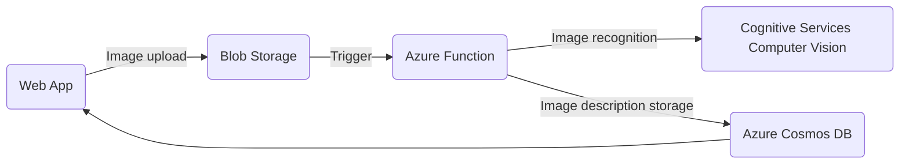

# Azure Cloud Infrastructure for Image Description Web Application

This project aims to create an Azure-based infrastructure for a web application that enables users to upload images. Upon image upload, an Azure Function is triggered, leveraging Azure Computer Vision to extract a description of the image. This description is intended to be stored in Azure Cosmos DB and relayed back to the user via the web application.

## Project structure

The project structure is relatively straightforward :
- The webapp folder contains a nodejs web application.
- The azure_function folder contains a python azure function. 
- The script archi.sh is designed to create Azure resources and deploy the web application and Azure Function.

## Project Status

As of the current iteration, the image description retrieval process through Azure Computer Vision within the Azure Function is functional. However, the implementation of the output binding to Azure Cosmos DB is pending. Several potential workarounds have been identified but have not yet been implemented.

- [x] Image upload on blob storage through web application
- [x] Azure function triggered by upload
- [x] Image recognition with Computer Vision
- [ ] Image description stored in Azure Cosmos DB
- [ ] Image description relayed to the user

## Next Steps

- Investigate and implement workarounds for enabling the output binding to Azure Cosmos DB.
- Further refine the integration between the Azure Function, Computer Vision, and Cosmos DB.
- Enhance the web application to display image descriptions retrieved from Cosmos DB.
  
